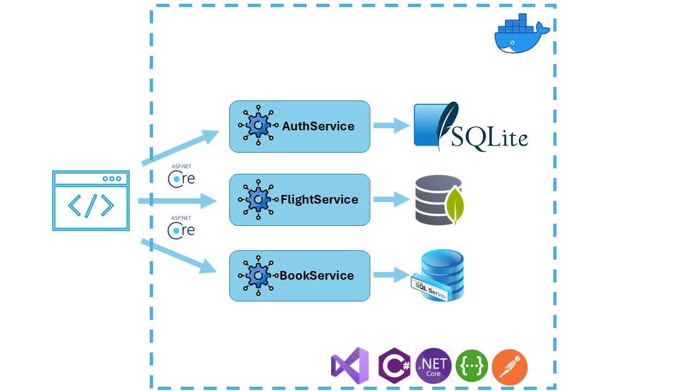
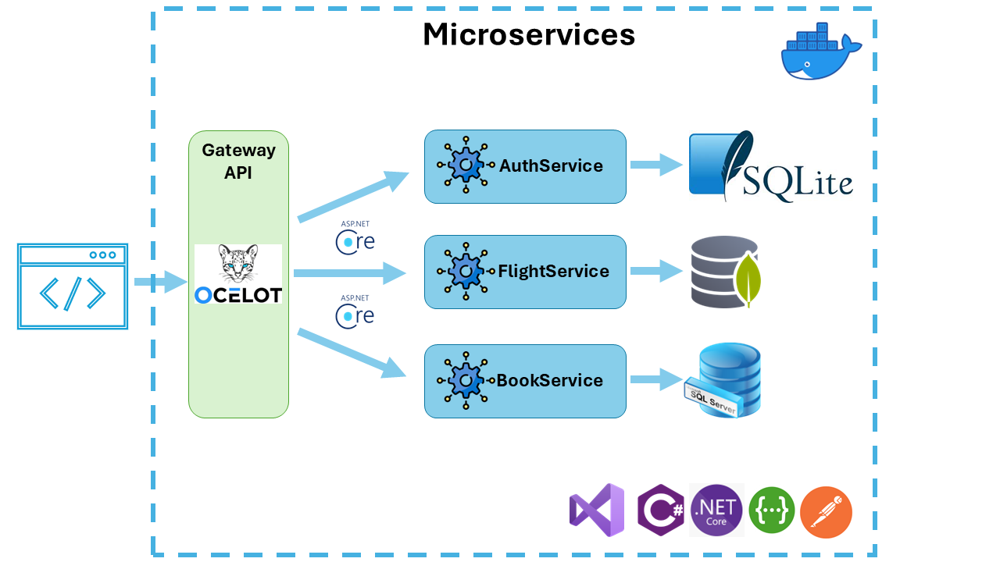

# SkyBooker Projekt Präsentation

## Inhaltsverzeichnis
1. Einleitung
   - Projektkontext
   - Projektziele
   - Projektumfang
2. Projektübersicht
   - Microservices-Architektur
   - Technologie-Stack
   - Entwicklungsprozess
3. Technische Umsetzung
   - Systemarchitektur
   - Datenmodell
   - Docker & Deployment
4. Live-Demo
   - API-Demonstration
   - Technische Features
5. Fazit & Ausblick

---

## 1. Einleitung

### 1.1 Projektkontext
Das SkyBooker-Projekt wurde im Rahmen des Moduls 321 entwickelt und implementiert eine globale Flugbuchungs- und Ticketreservierungslösung. Die Plattform ermöglicht die Verwaltung von Flügen verschiedener Fluggesellschaften und bietet Passagieren eine benutzerfreundliche Möglichkeit zur Buchung und Verwaltung ihrer Flugreisen.

### Teamaufteilung

Leon:  Microservice FlightService, Ocelot - MongoDB

David: Microservice Authentifizierung AuthService - SQL-Lite

Omda:  Microservice BookService - SQL-Server

### 1.2 Projektziele

#### 1.2.1 Hauptziele
- Entwicklung einer Microservices-basierten Architektur
- Implementation von drei Hauptservices:
  - FlightService (Flugplanverwaltung)
  - BookingService (Flugbuchung)
  - AuthService (Authentifizierung)
- Containerisierung mit Docker
- Implementierung von JWT-Authentifizierung

#### 1.2.2 Technische Ziele
- Entwicklung in ASP.NET Core/C#
- Integration verschiedener Datenbanksysteme (MongoDB, MS-SQL, SQLite)
- OpenAPI/Swagger Dokumentation
- Unit Testing Coverage
- Docker Containerisierung

### 1.3 Projektumfang

#### 1.3.1 Kernfunktionalitäten
1. **Flugplanverwaltung**
   - Erfassung und Verwaltung von Flügen
   - Verwaltung von Verfügbarkeiten
   - Routenmanagement

2. **Flugbuchungssystem**
   - Passagierbuchungen
   - Ticketverwaltung
   - Verfügbarkeitsprüfung

3. **Benutzerverwaltung**
   - Registrierung und Login
   - JWT-basierte Authentifizierung
   - Benutzerprofilverwaltung

---

## 2. Projektübersicht

### 2.1 Microservices-Architektur

#### 2.1.1 FlightService
- **Endpoints:**
  - POST /api/flight
  - GET /api/flight
  - GET /api/flight/{id}
- **Funktionen:**
  - Flugerfassung
  - Flugabfrage
  - Verfügbarkeitsprüfung

#### 2.1.2 BookingService
- **Endpoints:**
  - POST /api/booking
  - GET /api/booking
  - GET /api/booking/{id}
- **Funktionen:**
  - Buchungserfassung
  - Buchungsabfrage
  - Ticketverwaltung

#### 2.1.3 AuthService
- **Endpoints:**
  - POST /api/register
  - GET /api/login
- **Funktionen:**
  - Benutzerregistrierung
  - JWT-Token-Generierung
  - Authentifizierung



### 2.2 Technologie-Stack

#### 2.2.1 Backend-Technologien
- ASP.NET Core/C#
- Entity Framework Core
- JWT Authentication
- FluentValidation

#### 2.2.2 Datenbanken
- MongoDB (Flugplan)
- MS-SQL Server (Buchungen)
- SQLite (Authentifizierung)

#### 2.2.3 DevOps & Tools
- Docker & Docker Compose
- Git für Versionskontrolle
- Postman für API-Testing
- Swagger/OpenAPI

---



## 3. Technische Umsetzung

### 3.1 Systemarchitektur

#### 3.1.1 Datenmodell

1. **Flugplan (MongoDB)**
```javascript
{
    id: ObjectId,
    flightId: String,
    airlineName: String,
    source: String,
    destination: String,
    departure_time: DateTime,
    arrival_time: DateTime,
    available_seats: Number,
    created_at: DateTime,
    updated_at: DateTime
}
```

2. **Buchung (MS-SQL)**
```sql
CREATE TABLE Booking (
    Id INT IDENTITY(1,1) PRIMARY KEY,
    FlightId VARCHAR(50),
    PassengerId VARCHAR(50),
    PassengerFirstname VARCHAR(100),
    PassengerLastname VARCHAR(100),
    TicketCount INT,
    CreatedAt DATETIME,
    UpdatedAt DATETIME
)
```

3. **Benutzer (SQLite)**
```sql
CREATE TABLE User (
    Id INTEGER PRIMARY KEY AUTOINCREMENT,
    Username TEXT NOT NULL,
    EMail TEXT NOT NULL,
    Password TEXT NOT NULL
)
```

### 3.2 Docker & Deployment

#### 3.2.1 Docker-Konfiguration
```dockerfile
# Beispiel Dockerfile für FlightService
FROM mcr.microsoft.com/dotnet/aspnet:7.0 AS base
WORKDIR /app
EXPOSE 80

FROM mcr.microsoft.com/dotnet/sdk:7.0 AS build
WORKDIR /src
COPY ["FlightService.csproj", "./"]
RUN dotnet restore
COPY . .
RUN dotnet build -c Release -o /app/build

FROM build AS publish
RUN dotnet publish -c Release -o /app/publish

FROM base AS final
WORKDIR /app
COPY --from=publish /app/publish .
ENTRYPOINT ["dotnet", "FlightService.dll"]
```

#### 3.2.2 Docker Compose
```yaml
version: '3.8'
services:
  flightservice:
    build: ./FlightService
    ports:
      - "5001:80"
    depends_on:
      - mongodb

  bookingservice:
    build: ./BookingService
    ports:
      - "5002:80"
    depends_on:
      - sqlserver

  authservice:
    build: ./AuthService
    ports:
      - "5003:80"
```

---

## 4. Live-Demo

### 4.1 API-Demonstration

#### 4.1.1 Flugplan-API
- Demonstration der Flugerfassung
- Abfrage von Flugdetails
- Verfügbarkeitsprüfung

#### 4.1.2 Buchungs-API
- Buchungsprozess
- Ticketreservierung
- Buchungsbestätigung

#### 4.1.3 Auth-API
- Registrierungsprozess
- Login und Token-Generierung
- Geschützte Endpunkte

### 4.2 Technische Features

#### 4.2.1 Implementierte Features
- JWT-Authentifizierung
- Swagger Documentation
- Docker Container
- Unit Tests

#### 4.2.2 Optionale Features
- Serilog Logging
- API Gateway (Ocelot)
- Microservices-Kommunikation
- Validierung der Sitzplatzkapazität

---

## 5. Fazit

### 5.1 Projekterfolge

#### 5.1.1 Technische Erfolge
- Erfolgreiche Microservices-Implementation
- Sichere JWT-Authentifizierung
- Docker-Containerisierung
- Vollständige API-Dokumentation

#### 5.1.2 Lessons Learned
- Bedeutung der Microservices-Architektur
- Herausforderungen bei der Datenbankintegration
- Docker-Deployment-Prozess
- Team-Koordination und Zeitmanagement

### 5.2 Ausblick

#### 5.2.1 Mögliche Erweiterungen
- Integration weiterer Fluggesellschaften
- Erweitertes Buchungsmanagement
- Mobile App-Entwicklung
- Erweiterte Analysefunktionen

---

*Vielen Dank für Ihre Aufmerksamkeit!* 